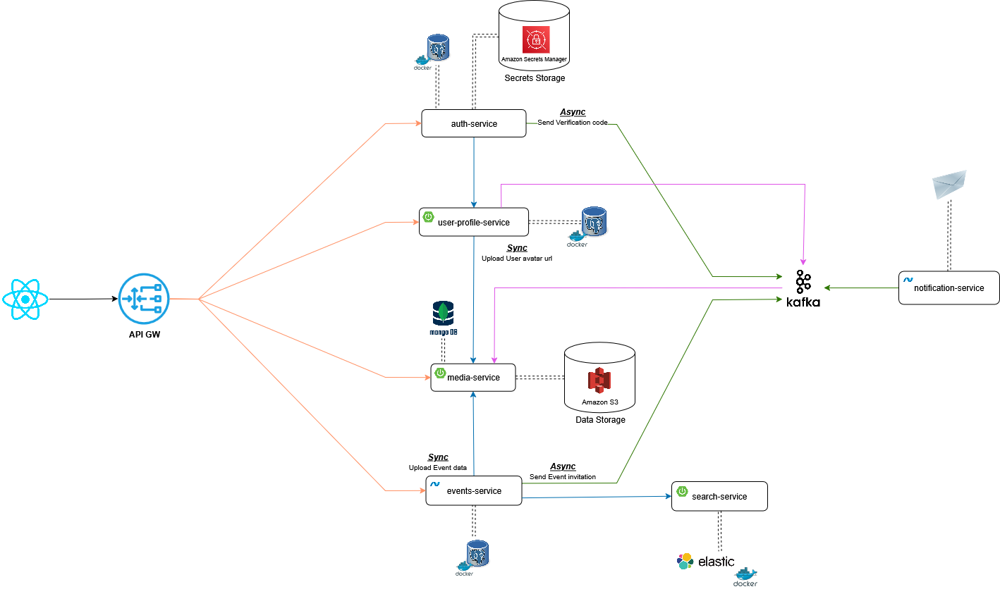

# Misto Zhyttya 🏙

**Misto Zhyttya** – a modular microservices-based platform for organizing, managing, and participating in local community initiatives, public events, and city development activities. This project supports user profiles, role-based access, authentication (including Google/LinkedIn), event management, notifications, messaging, and statistics dashboards. 

---

## 📌 Technology Stack

- **Java 21**
- **Spring Boot** (Web, Data, Security)
- **PostgreSQL**, **MongoDb**
- **Docker** and **Docker Compose**
- **Maven**
- **Kafka**

---

## 🚀 Project Setup

### 1. Clone the repository
```bash
git clone https://github.com/Jarik13/misto-zhyttya.git
cd misto-zhyttya
```

### 2. Configure environment variables

Copy the example .env.example file to .env:

```bash
cp .env.example .env
```

Edit .env and fill in the values for all variables:
```bash
AWS_ACCESS_KEY_ID=
AWS_SECRET_ACCESS_KEY=
AWS_REGION=
AWS_BUCKET_NAME=
OAUTH2_CLIENT_GOOGLE_CLIENT_ID=
OAUTH2_CLIENT_GOOGLE_CLIENT_SECRET=
OAUTH2_CLIENT_GITHUB_CLIENT_ID=
OAUTH2_CLIENT_GITHUB_CLIENT_SECRET=
```

### 3. Run the project using Docker Compose
```bash
docker-compose up --build
```

📂 Project Structure
```bash
misto-zhyttya/
│── auth-service/               # Authentication and authorization service
│── user-profile-service/       # User profile service
│── media-service/              # Core logic with media (avatars, events)
│── api-gateway/                # API Gateway
│── docs/                       # Documentation folder
│   └── misto-zhyttya-diag.png  # Microservices architecture diagrams
│── docker-compose.yml          # Services orchestration
│── .env.example                # Example environment variables
```

## Architecture Diagram

Below is the architecture diagram of the project:

